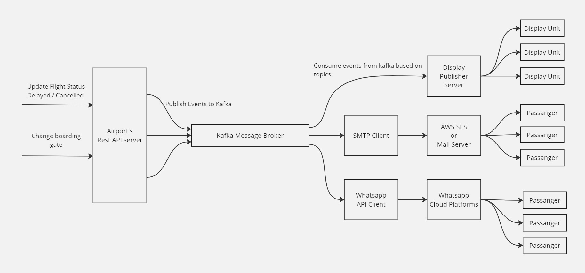
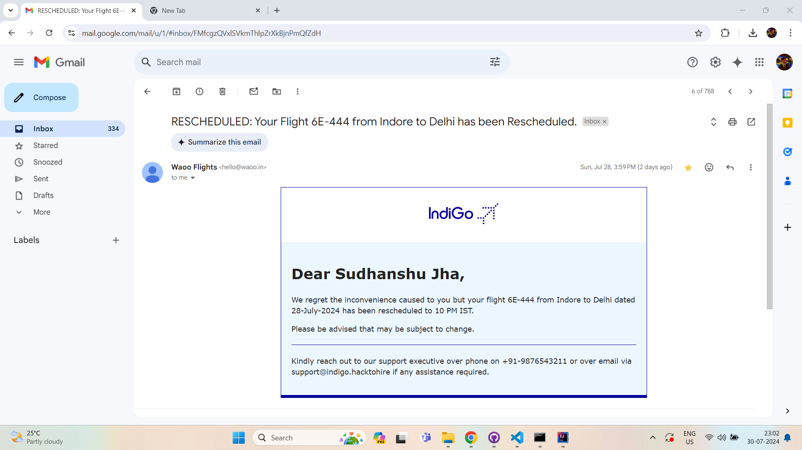
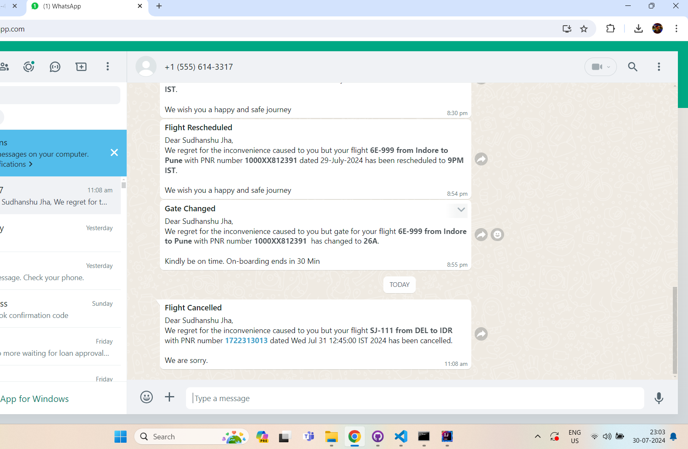
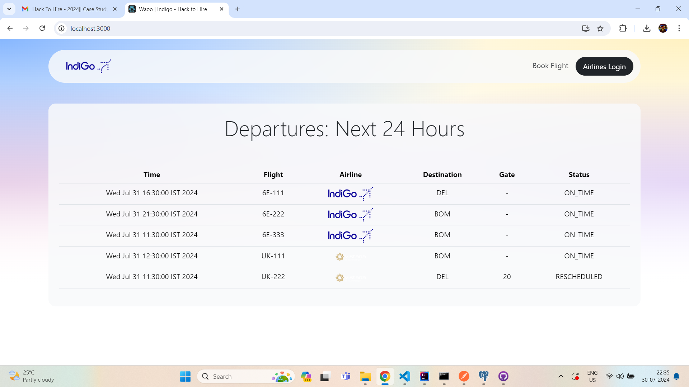

# Hack to Hire - Backend #

### *Notification Channels* ###
- Email - via AWS SES
- Whatsapp Message
- Push Notification (Over Websocket, for Display units as airport)

### *Tech Used* ###
- Java
- Spring Boot
- Websockets (For real time communication)
- Kafka (As message broker)
- PostgreSQL
- AWS SES (as SMTP Server)
- Whatsapp Cloud API (for whatsapp Notification)

### *Flow of Event (Notification)* ###



### *Short Summary* ###

This push-based system ensures that passengers are informed of any changes in flight status through various channels, such as email, WhatsApp, and display units at the airport, providing a comprehensive and efficient notification mechanism.

- Java, combined with Spring Boot, forms the backbone of the system, providing a robust and scalable framework for developing and managing the application. Spring Boot simplifies the setup and development of new services.

- Kafka is employed for handling real-time data streams, ensuring efficient and reliable messaging between different components of the system. It is crucial for managing the high volume of data related to flight status updates.

- WebSocket is used to establish a persistent connection between the server and clients, allowing for real-time communication. This ensures that passengers receive updates instantaneously.

-  PostgreSQL is the relational database management system used to store and manage flight data, passenger information, and notification logs. It provides a reliable and efficient way to handle large datasets.
-

Email Notification Sample


Whatsapp Notification Sample


Push Notification Sample (To Display unit)



### *Running Services* ###
Step 1: Start Apache ZooKeeper
```
C:\kafka\bin\windows\zookeeper-server-start.bat C:\kafka\config\zookeeper.properties
```

Step 2: Start Kafka Server

````
C:\kafka\bin\windows\kafka-server-start.bat C:\kafka\config\server.properties
```

Step 3: Start Main Application (Rest API Server)

Step 4: Start ASW SES Client Server (SMTP Client Server)

Step 5: Start Whatsapp Cloud API Client Server

Step 6: Start Display Publisher Server (To push to Dispaly units)
